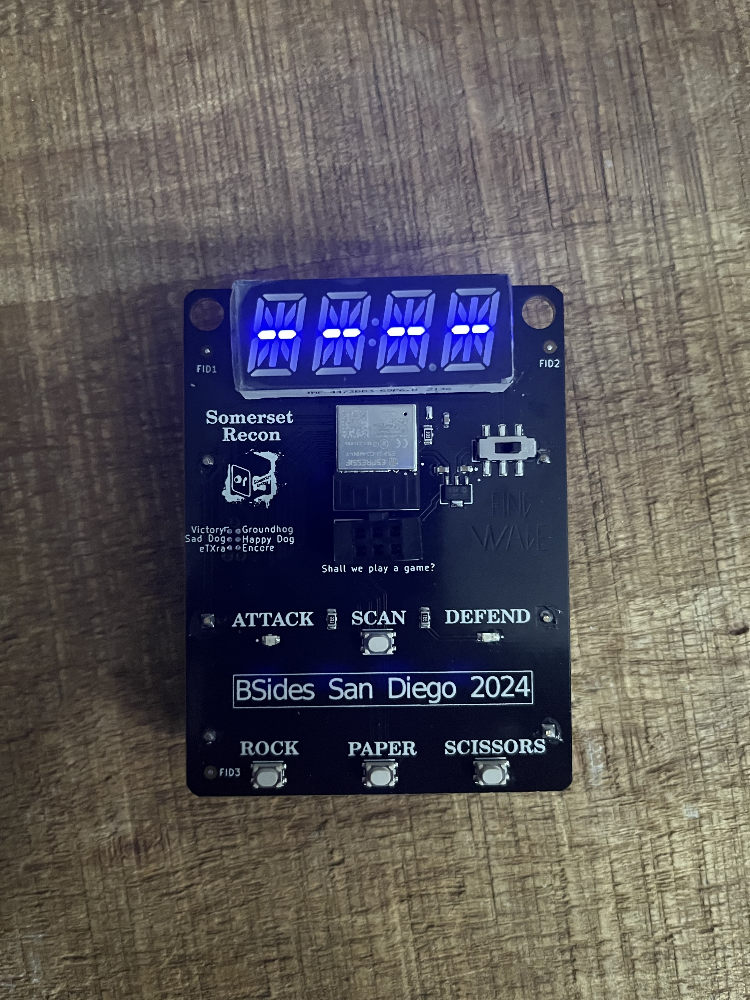
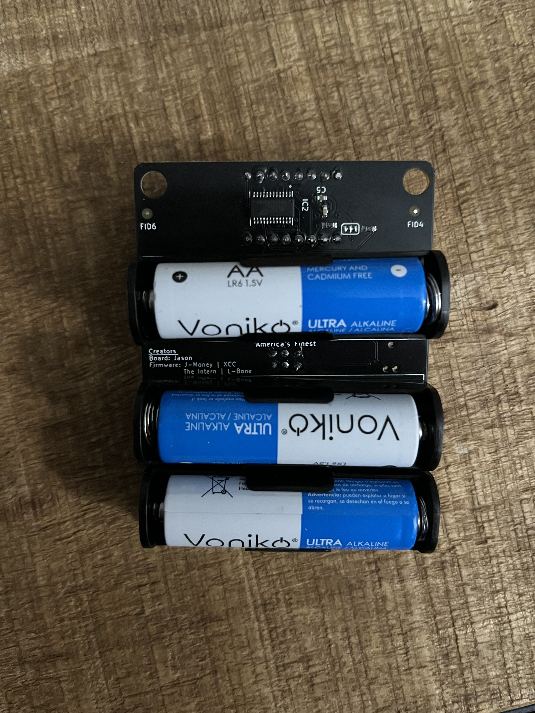
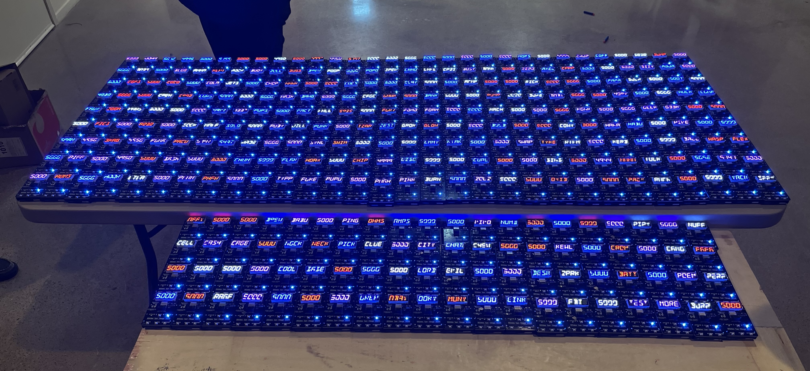
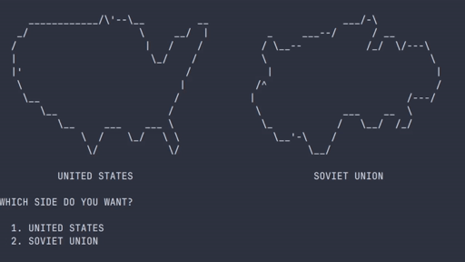
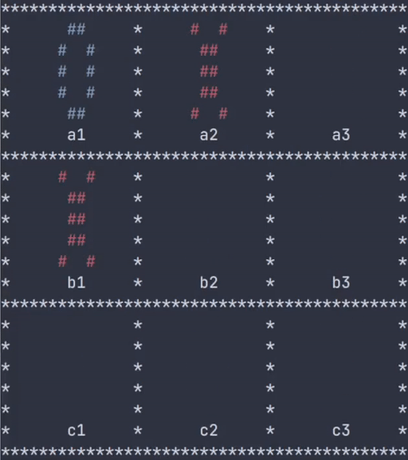

# BSides Badge 2024

<table>
  <tr>
    <td></td>
    <td></td>
  </tr>
  <tr>
    <td><em>
Front
</em></td>
    <td><em>
Back
</em></td>
  </tr>
  <tr>
 </table>
<table>
  <tr>
    <td></td>
  </tr>
  <tr>
    <td align=center><em>Flashed Badges</em></td>
  </tr>
  <tr>
 </table>
 

This repository contains hardware and firmware information needed to create and/or modify the Bsides Conference 2024 badge. All Gerber files, kiCad schematics, and other hardware-related files can be found in the "kiCad" folder. Associated source code and required libraries can be found in the "software" folder. We welcome BSides CTF players to submit writeups. Badge related writeups will be populated below.

Disclaimer: Somerset Recon is not liable nor responsible for any and all forks, branches, and duplication of the badge hardware or software created by an entity other than Somerset Recon.

The Badge for the San Diego Bsides Conference is a game that involves wireless rock-paper-scissors. There are hidden hacking challenges accessible over UART with a Wargames movie theme. 400 badges were distributed at the BSides San Diego 2024 Conference.

## Gameplay

The object of the game was to score the most points. Points were earned by hacking other players. The badges have two states: Attack mode and defend mode. 

 	A red LED on a badge will indicate that the player is in attack mode. Players will click the scan button. During a scan, BLE on the baddge will search for devices that are advertising (devices in defend mode). Once a connection is established, the player will be notified to choose rock, paper or scissors. The attacker gains points for each second they are connected to a defender. Once the defender notices that they are being attacked, they will choose rock, paper, or scissors. 
## WOPR Interface

<table>
  <tr>
    <td></td>
    <td></td>
  </tr>
  <tr>
    <td align=center><em>Global Thermonuclear War</em></td>
    <td align=center><em>Tic-Tac-Toe</em></td>
  </tr>
  <tr>
</table>

Various challenges in the form of WOPR games are accessible using UART over the SAO connector. Each challenge contains its own flag to earn points in the BSides CTF.

# Flashing Instructions
> [!NOTE]
> In the latest source code, a cool glitch-like display will appear for the custom name when "SCAN" is held at boot. The conference badges were flashed with earlier firmware and do not have this feature. To add this glitch-like display, the badge must be flashed with the latest source code.
## Materials
- Arduino IDE
- TAG Connector (6-pin without legs)
## Procedure
1. Copy the Ticker library in this repository to the arduino library folder. Do *not* download the Ticker library via the Library Manager.
2. Open the Arduino IDE.
3. Open the source code file "latest.ino". All files in the folder should be automatically added when loaded.
4. Navigate to Board Manager and download the "esp32" board by Espressif Systems.
5. Turn on the badge and connect the TAG Connector to the TAG port. Plug the TAG connect to your computer via USB.
6. Select the board "ESP32C3 Dev Module" and choose the port that the badge is connected to.
7. Press Upload. If the compilation fails, ensure you have all necessary libraries downloaded.
